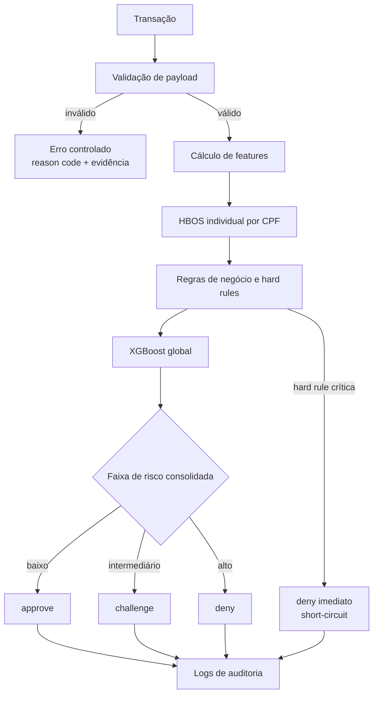
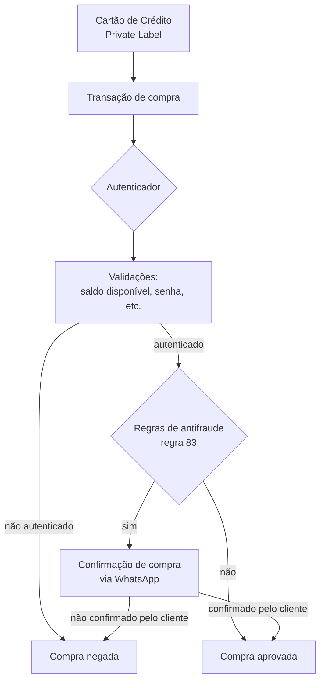
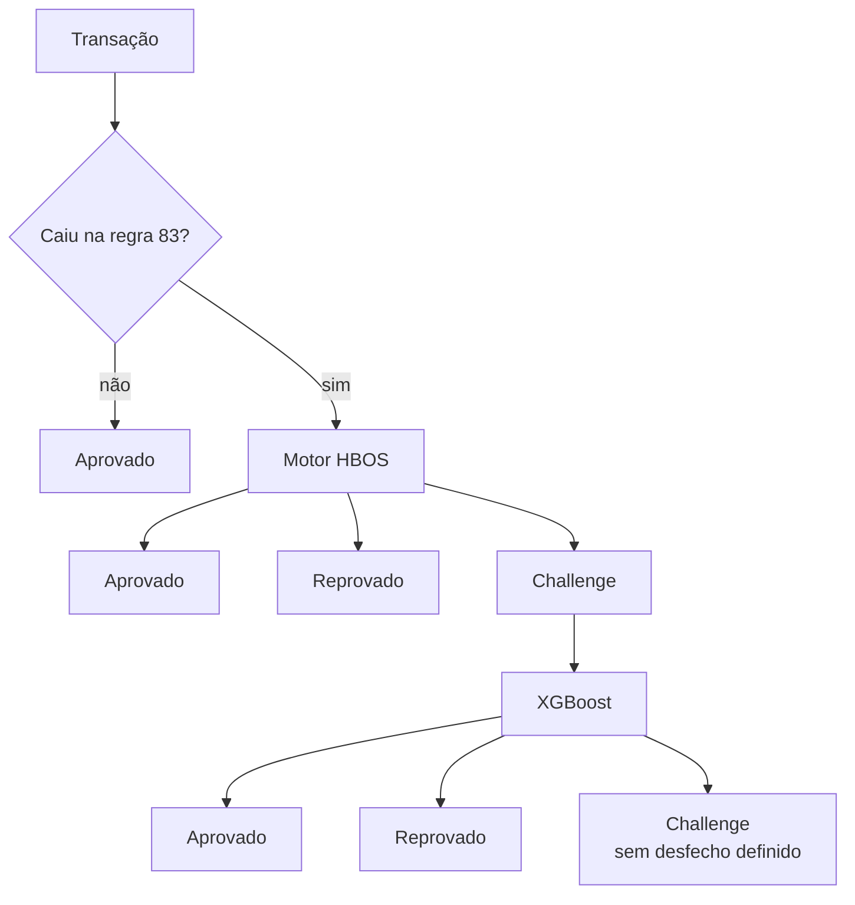

# AS-IS — Motor de Score Antifraude

Escopo: o que existe e está documentado hoje. Nada aqui descreve evolução planejada — para isso,
ver [`to-be.md`](to-be.md) e [`../evolucoes/`](../evolucoes/).

O AS-IS foi reconstruído a partir de três fontes que **não são idênticas**: a especificação
original do microserviço, a apresentação mais recente e os diagramas operacionais do produto
Cartão Private Label. As divergências não foram harmonizadas artificialmente: estão registradas na
seção [Divergências entre fontes](#divergências-entre-fontes) e no
[registro de lacunas](lacunas-e-riscos.md).

## 1. Natureza do serviço

- Microserviço de score antifraude para transações, com decisão **online** no caminho de
  autorização.
- Meta de performance declarada: **fast path de approve/deny com p95 inferior a 100 ms**.
- Decisão em **cascata com short-circuit**: uma camada pode encerrar antecipadamente a análise
  para preservar latência.
- Saídas possíveis da decisão online: `approve`, `challenge`, `deny`.

## 2. Cascata de decisão documentada na especificação



## 3. Fluxo operacional dos diagramas do produto (Private Label)

Os diagramas do produto descrevem a jornada completa e revelam dois elementos que a especificação
textual não menciona: a **regra 83 como porta de entrada** do motor e a **confirmação por WhatsApp**
como tratamento de suspeita.





Leituras relevantes desses diagramas:

- **A regra 83 funciona como gate de custo.** Transações que não a acionam são aprovadas sem passar
  pelo HBOS ou pelo XGBoost. Isso protege latência e custo, mas significa que o motor de modelos só
  observa o subconjunto selecionado por uma regra determinística — com consequências diretas para
  retreinamento e medição de performance (ver `LR-04` em [lacunas](lacunas-e-riscos.md)).
- **O XGBoost aparece como segunda instância de decisão**, acionado pelo `challenge` do HBOS, e não
  como camada sempre executada.
- **O `challenge` do XGBoost não tem destino.** É o ponto terminal do diagrama, sem fila, step-up,
  análise humana ou notificação. É a lacuna principal do sistema (`LR-01`).
- **A confirmação por WhatsApp já existe como mecanismo de step-up** para os casos de regra 83, com
  semântica de negação por não confirmação. É um ativo reaproveitável para o `challenge`, desde que
  ganhe idempotência, timeout explícito e política declarada de fail-open/fail-closed (`LR-06`).

## 4. Componentes de decisão

### 4.1 HBOS individual por CPF

| Aspecto | AS-IS |
| --- | --- |
| Tipo | Não supervisionado, detecção de anomalia |
| Treino | Offline, um modelo por CPF |
| Comparação | Nova transação contra o histórico do próprio cliente |
| Artefato | Bundle com modelo, scaler, perfis estatísticos e metadados |
| Serving | Cache em memória |
| Janela de histórico | Até aproximadamente 730 dias |
| Semântica do score | Score alto = comportamento atípico |

Score alto **não é prova de fraude**. O HBOS é sinal comportamental, não classificador
determinístico de fraude, e não deve sustentar sozinho uma negação. Cliente legítimo com
comportamento naturalmente variável produz score alto sem fraude.

### 4.2 XGBoost global

| Aspecto | AS-IS |
| --- | --- |
| Tipo | Supervisionado, binário fraude / não fraude |
| Treino | Rótulos históricos |
| Papel | Padrões globais e interações entre features |
| Complemento | Cobre CPF novo ou com histórico insuficiente, onde o HBOS é fraco |
| Dependência crítica | Qualidade, maturação e representatividade dos rótulos |
| Validação exigida | Divisão temporal e controles contra leakage |

### 4.3 Regras de negócio e hard rules

- Regras determinísticas complementam os modelos.
- Dimensões avaliadas: horário, valor, parcelas, estabelecimento novo, geolocalização, device
  intelligence, blocklists e viagem impossível.
- **Hard rules críticas podem prevalecer sobre scores probabilísticos.**
- Toda regra deve gerar evidência e reason code auditável.

## 5. Contrato da API

### 5.1 Especificação original

```json
{
  "score": 0.0,
  "decision": "approve | challenge | deny",
  "signals": [],
  "features": {},
  "feature_weights": {}
}
```

### 5.2 Implementação vigente conforme a apresentação mais recente

```json
{
  "decision_final": "approve | challenge | deny"
}
```

Score, sinais, features e pesos permanecem apenas em logs ou eventos internos. Qualquer consumidor
que precise de explicabilidade hoje depende de log, não de contrato. Ver `LR-02`.

## 6. Divergências entre fontes

| ID | Tema | Especificação original | Apresentação recente | Diagramas do produto |
| --- | --- | --- | --- | --- |
| D-1 | Ordem da cascata | HBOS → regras → XGBoost | não detalha | regra 83 → HBOS → XGBoost (condicional) |
| D-2 | Acionamento do XGBoost | camada sempre executada | não detalha | acionado apenas pelo `challenge` do HBOS |
| D-3 | Entrada no motor | toda transação válida | não detalha | somente transações que acionam a regra 83 |
| D-4 | Resposta HTTP | 5 campos estruturados | apenas `decision_final` | não aplicável |
| D-5 | Tratamento de suspeita | `challenge` como faixa de decisão | `challenge` sem fluxo | WhatsApp para regra 83; `challenge` do XGBoost sem destino |

Enquanto D-1, D-2 e D-3 não forem resolvidos com evidência de produção (trace real da execução das
camadas), qualquer afirmação sobre "qual camada decide" é inferência. A instrumentação de
`decision trace` descrita em [`../mlops/observabilidade-e-shadow.md`](../mlops/observabilidade-e-shadow.md)
é o que transforma essa dúvida em fato mensurável, e por isso é pré-requisito das evoluções.

## 7. O que comprovadamente **não** existe hoje

Registro explícito para evitar que planejamento seja lido como estado atual:

- Não há fluxo operacional de `challenge` (fila, step-up padronizado, análise humana, notificação
  rastreável) para a faixa intermediária produzida pelos modelos.
- Não há AutoML em produção, nem no hot path nem no ciclo offline formalizado.
- Não há agentes de IA nem Agent Framework Workflows em produção.
- Não há invalidação automática de cache após republicação de modelo.
- Não há política de cold start configurável por valor, canal e produto.
- Não há API v2 com explicabilidade autenticada.
- Não há amostragem em shadow das camadas suprimidas pelo short-circuit.
