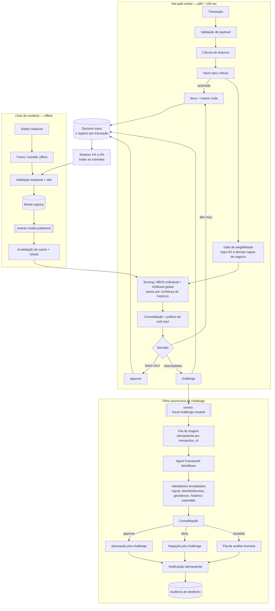

# TO-BE — Arquitetura alvo

Evolução proposta. Nada nesta página está em produção. Cada bloco tem critério de aceite no
documento de evolução correspondente.

Princípio estruturante: **separar o hot path de autorização da trilha de tratamento de risco.**
O hot path continua sendo uma cascata determinística e barata, com p95 abaixo de 100 ms. Tudo que
é lento, externo, humano ou probabilístico-experimental vive fora dele, em processamento
assíncrono disparado por evento.

## 1. Visão geral

## 2. Decisões de arquitetura

### 2.1 O `challenge` é um evento, não uma resposta HTTP

A trilha de tratamento consome `fraud.challenge.created` — contexto completo publicado pelo motor —
e nunca a resposta HTTP da autorização. Três razões: a resposta v1 expõe apenas `decision_final`;
acoplar orquestração à requisição sincroniza o hot path com integrações lentas; e o desfecho pode
chegar minutos depois, quando a conexão HTTP já não existe.

Contrato: [`fraud.challenge.created`](../contratos/schemas/fraud.challenge.created.schema.json).

### 2.2 Contrato versionado, explicabilidade sob autorização

- **v1** permanece com `decision_final` e retrocompatibilidade garantida. Nenhum campo novo
  obrigatório, nenhuma mudança de semântica.
- **v2** entrega `score`, `decision`, `signals`, `features`, `feature_weights`, `reason_codes` e
  versões de modelo, com autenticação, autorização por perfil, mascaramento e limites de
  detalhamento por perfil de consumidor.

O nível de detalhe é função do perfil, não do endpoint: canal externo recebe reason code
agregado e não recebe threshold, peso de feature nem nome de regra interna (LR-13).
Ver [contratos](../contratos/README.md) e [LGPD](../governanca/lgpd-e-dados-sensiveis.md).

### 2.3 Pesos por confiança do histórico, não por presença de modelo

O peso do HBOS passa a ser função da confiança disponível — volume e recência do histórico do CPF —
em vez de "existe bundle, então usa". Histórico insuficiente reduz ou zera o peso do HBOS e desloca
a decisão para o modelo global e para as regras, com reason code `RC_COLD_START` explícito.
Ver [Evolução 3](../evolucoes/03-cold-start.md).

### 2.4 HBOS como sinal, hard rule como veto

Ordem de precedência na consolidação:

1. Hard rule crítica de veto (blocklist, viagem impossível confirmada) — determinística, prevalece.
2. Score consolidado das camadas probabilísticas, com pesos por confiança.
3. Política de cold start e de canal/produto.

O HBOS nunca é suficiente para `deny` isolado: anomalia alta sem corroboração de regra ou de modelo
global resolve para `challenge`, não para negação (LR-09).

### 2.5 Fallback declarado por camada

Cada camada declara comportamento sob falha, para que indisponibilidade não vire política implícita:

| Camada | Falha | Comportamento alvo | Registro |
| --- | --- | --- | --- |
| Bundle HBOS ausente no cache | miss | segue sem HBOS, peso redistribuído | `RC_HBOS_UNAVAILABLE` |
| XGBoost indisponível | erro/timeout | decide por regras + HBOS; faixa intermediária vira `challenge` | `RC_MODEL_UNAVAILABLE` |
| Feature externa (geo, device) | timeout | feature nula tratada como desconhecida, nunca como benigna | `RC_FEATURE_MISSING` |
| Blocklist indisponível | erro | fail-closed para faixa alta, `challenge` para o resto | `RC_BLOCKLIST_UNAVAILABLE` |
| Cache distribuído indisponível | erro | mantém versão local ativa e alerta divergência | `RC_CACHE_DEGRADED` |

Nenhum fallback é silencioso: todos registram reason code e alimentam o decision trace (LR-15).

### 2.6 Short-circuit preservado, observabilidade obrigatória

O short-circuit permanece — é o que sustenta o p95. O que muda é que toda transação passa a
registrar camadas executadas, camadas suprimidas e camada terminal, e uma amostra de 1% a 5% roda
todas as camadas em shadow, sem influenciar a decisão online.
Ver [observabilidade e shadow](../mlops/observabilidade-e-shadow.md).

### 2.7 AutoML e agentes fora do caminho crítico

AutoML é ferramenta offline de exploração e comparação de candidatos. O serviço de autorização
consome exclusivamente artefatos aprovados, versionados e serializados em cache ou armazenamento de
baixa latência. Agentes de IA atuam apenas como apoio assíncrono à triagem de `challenge`, depois
dos validadores determinísticos, e não substituem hard rules nem políticas determinísticas.
Ver [promoção e rollout](../mlops/promocao-e-rollout.md).

## 3. Orçamento de latência do hot path

Alvo p95 < 100 ms para approve/deny. Distribuição de referência para dimensionar alarme por etapa:

| Etapa | Orçamento p95 |
| --- | --- |
| Validação de payload | 3 ms |
| Cálculo de features (sem chamada externa bloqueante) | 25 ms |
| Hard rules + regras de negócio | 10 ms |
| HBOS (cache hit) | 12 ms |
| XGBoost | 20 ms |
| Consolidação, trace e publicação assíncrona do evento | 10 ms |
| Folga | 20 ms |

Publicação de evento e escrita de trace não bloqueiam a resposta: são enfileirados localmente com
descarte controlado e métrica de perda, porque perder trace é ruim, mas estourar o p95 de
autorização é pior — e a perda tem que ser visível.

## 4. Enumerações canônicas

Usadas em contratos, eventos e trace. Alterar exige nova versão de schema.

**`decision`** (online): `approve` | `challenge` | `deny`
**`challenge_outcome`**: `approve` | `deny` | `escalate`
**`layer`**: `payload_validation` | `feature_computation` | `hard_rules` | `eligibility_gate` |
`hbos_individual` | `business_rules` | `xgboost_global` | `decision_consolidation`
**`label_status`**: `fraude_confirmada` | `fraude_suspeita` | `em_disputa` |
`legitima_confirmada` | `sem_desfecho`
**`model_state`**: `candidate` | `challenger` | `champion` | `deprecated` | `rolled_back`

Catálogo de reason codes: [`../contratos/reason-codes.md`](../contratos/reason-codes.md).
