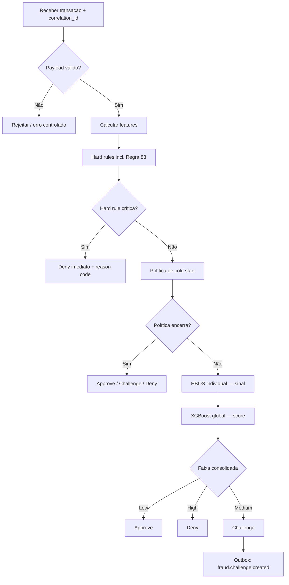
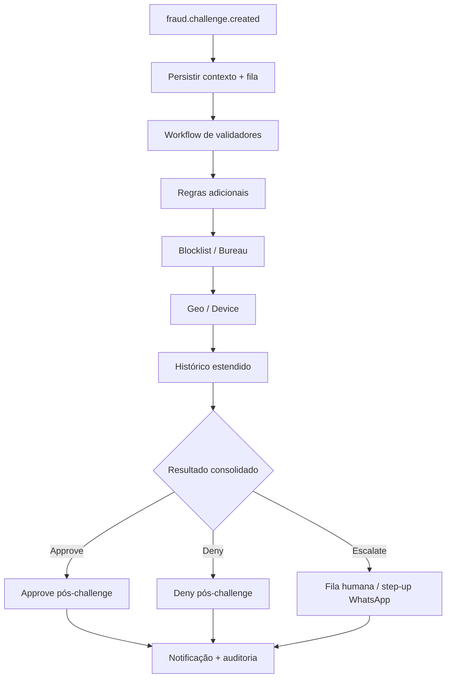
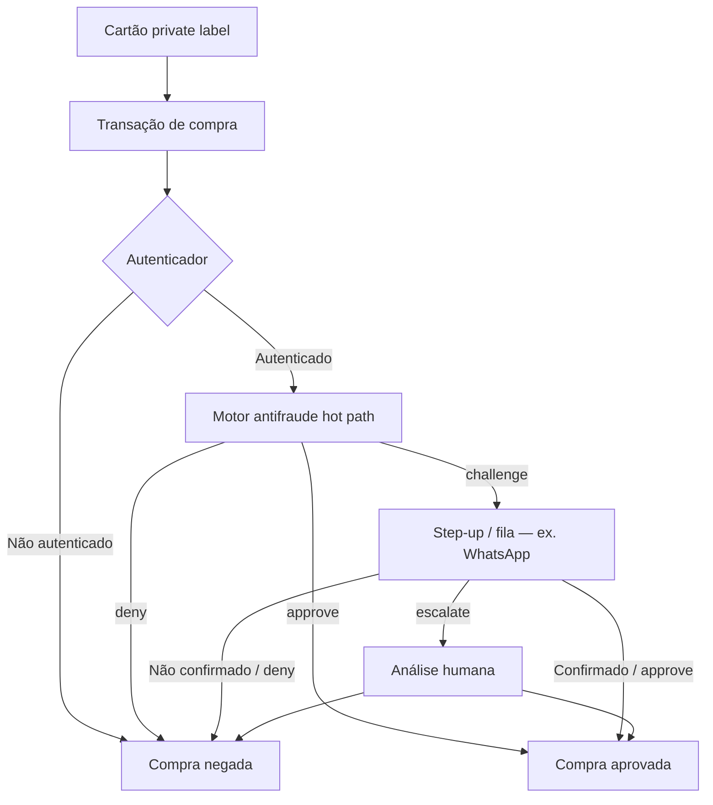
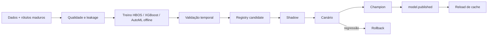
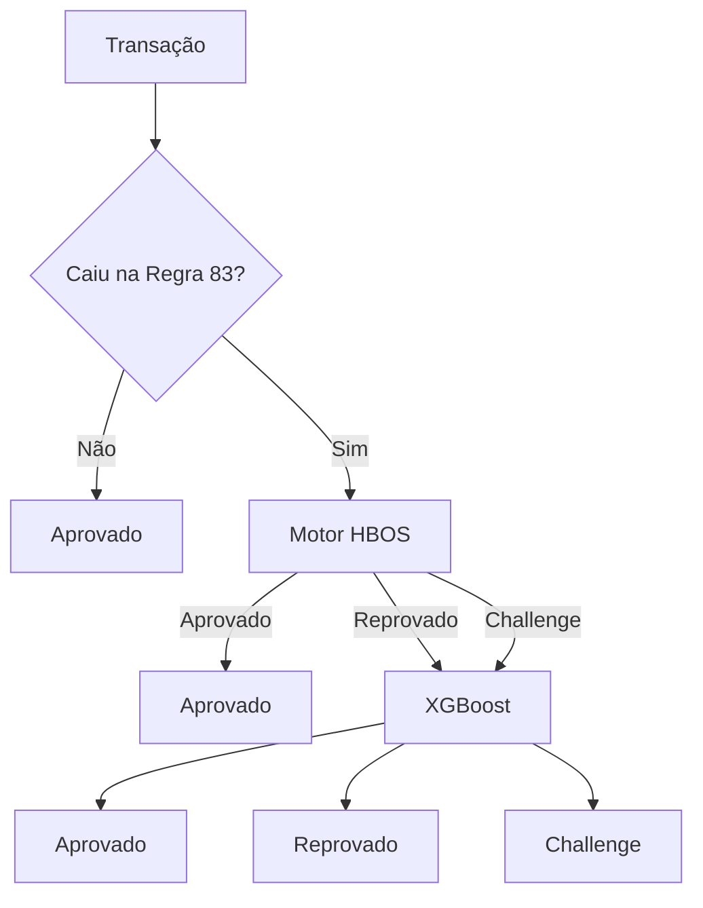

# Diagramas TO-BE

Os diagramas abaixo consolidam o texto operacional e os três fluxogramas de
referência, já **reconciliados** (Regra 83 como hard rule; WhatsApp na trilha
de challenge; AutoML/agentes fora do hot path).

## 1. Hot path síncrono (AS-IS evoluído)

SLA: p95 < 100 ms até `Approve` / `Deny` / `Challenge` (a publicação do outbox
é local e assíncrona em relação a integrações externas).

## 2. Trilha operacional de challenge (TO-BE planejada)

Agent Framework Workflows entra **nesta** trilha, não no hot path. Ainda não
está em produção.

## 3. Relação com o fluxo de compra private label

## 4. Ciclo de modelos (offline)

## 5. Cascata AS-IS técnica (documentada, não alvo)

Mantida para rastreabilidade da divergência:

Essa cascata **não** é o TO-BE. Ver [ADR-006](adr/006-regra-83-hard-rule.md).
