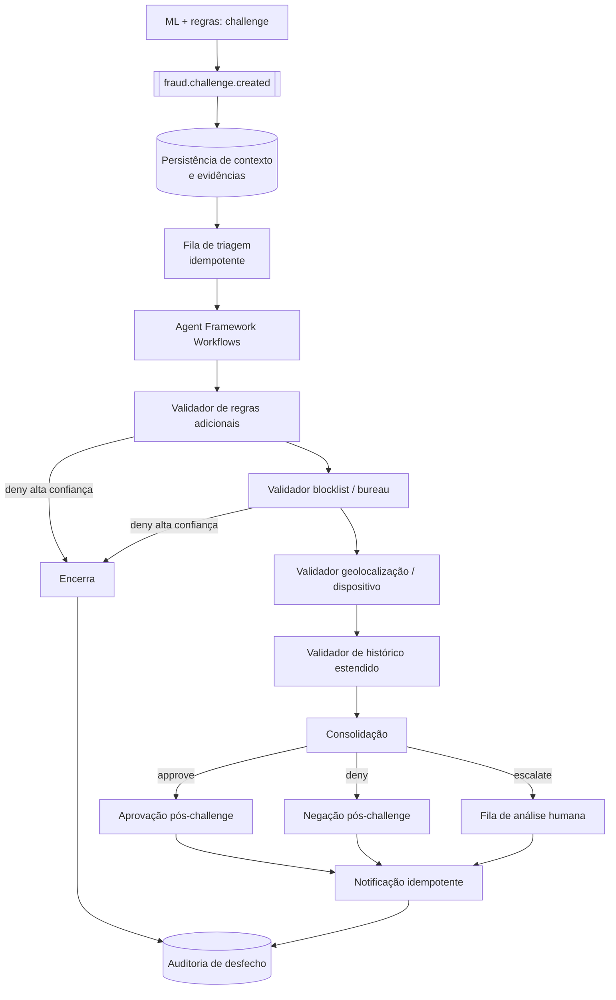

# Evolução prioritária 1 — Operacionalizar o `challenge`

Endereça `LR-01`, `LR-02` e `LR-06`. É a evolução de maior valor: hoje a faixa intermediária existe
na lógica de decisão e não existe na operação.

## AS-IS

- A decisão online pode resultar em `challenge`.
- Não há fila, step-up padronizado, análise humana, validação adicional ou notificação para esse
  resultado. No diagrama do produto, o `challenge` do XGBoost é nó terminal.
- Existe confirmação por WhatsApp, porém restrita aos casos de regra 83, com negação por não
  confirmação e sem política declarada de timeout.
- A resposta HTTP expõe apenas `decision_final`; score, sinais, features e pesos ficam em logs.

## Lacuna / Risco

Um caso classificado como questionável não gera ação. O resultado prático é o pior dos dois mundos:
não protege contra fraude (nada é verificado) e não protege o cliente legítimo (nenhuma tratativa
resolve o caso). Além disso, sem desfecho registrado não existe rótulo de retorno para retreinar a
faixa intermediária — exatamente a região onde o modelo é mais incerto e onde mais se aprenderia.

Tentar orquestrar sobre a resposta HTTP v1 agravaria o problema: acoplaria integrações externas
lentas ao caminho de autorização e quebraria o p95 de 100 ms.

## TO-BE

### Sequência de implementação

A ordem é dependente: cada passo precisa do anterior para ser verificável.

| # | Entrega | Depende de | Por que nesta posição |
| --- | --- | --- | --- |
| 1 | Publicação de `fraud.challenge.created` | decision trace instrumentado | Sem evento não há trilha; sem trace o evento não tem contexto confiável |
| 2 | Persistência de contexto e evidências da decisão inicial | 1 | Torna o caso auditável antes de qualquer automação |
| 3 | Fila de triagem idempotente | 2 | Desacopla produção de consumo e absorve pico |
| 4 | Regras adicionais e calibração de decisão | 3 | Controle determinístico resolve a maior parte antes de custo externo |
| 5 | Step-up de autenticação, quando aplicável | 4 | Só faz sentido para casos que sobrevivem às regras |
| 6 | Fila de análise humana para `escalate` | 5 | Garante que baixa confiança tem saída |
| 7 | Notificação idempotente e rastreável | 5 e 6 | Fecha o ciclo com o cliente sem duplicar mensagem |
| 8 | Integrações externas (bureau, blocklist, geo, device) | 3 | Latência e custo aceitáveis apenas fora do hot path |
| 9 | Agentes de IA assíncronos como apoio à triagem | 1 a 8 | Entram depois dos controles determinísticos, como apoio |

Agentes de IA **não** substituem hard rules nem políticas determinísticas em decisões críticas.

### Dados mínimos do evento

Definidos em [`fraud.challenge.created`](../contratos/schemas/fraud.challenge.created.schema.json):
`transaction_id`, `correlation_id`, identificador interno ou CPF tokenizado, `timestamp`, score
HBOS, score XGBoost, score consolidado, sinais e regras acionadas, features relevantes, versões dos
modelos, camadas executadas, camada que elevou ou encerrou o risco, decisão inicial e o contexto
necessário aos validadores.

CPF trafega **tokenizado**; features livres de PII direta; retenção declarada por finalidade
(ver [LGPD](../governanca/lgpd-e-dados-sensiveis.md)).

### Contrato dos validadores

Cada validador ([schema](../contratos/schemas/validator-result.schema.json)):

- contrato de entrada e saída versionado;
- retorna `approve`, `deny` ou `escalate`;
- retorna evidências e reason codes;
- possui timeout e circuit breaker;
- possui fallback seguro declarado (indisponibilidade nunca resolve para `deny` silencioso);
- gera tracing, logs e métricas;
- é testável isoladamente;
- não bloqueia indefinidamente a decisão.

O workflow suporta checkpoint e retomada de estado para integrações externas lentas e para step-up,
que pode levar minutos aguardando o cliente.

### Política de step-up (resolve `LR-06`)

"Não confirmado" precisa ser desagregado. Cada terminação tem tratamento e reason code próprios:

| Terminação | Significado | Desfecho alvo | Reason code |
| --- | --- | --- | --- |
| Cliente confirma | Sinal positivo forte | `approve` | `RC_STEPUP_CONFIRMED` |
| Cliente nega | Sinal negativo forte | `deny` + trilha de bloqueio | `RC_STEPUP_DENIED` |
| Timeout sem resposta | Ausência de sinal, não negação | política por faixa: baixo valor → `approve` monitorado; alto valor → `escalate` | `RC_STEPUP_TIMEOUT` |
| Canal indisponível / contato inválido | Falha do canal, não do cliente | `escalate` ou canal alternativo | `RC_STEPUP_UNREACHABLE` |

Tratar timeout e canal indisponível como fraude penaliza justamente o cliente sem device ativo,
sem dado de contato atualizado ou em região com conectividade ruim — um vetor de exclusão que
aparece como falso positivo concentrado em coorte (ver [viés](../mlops/vies-e-equidade.md)).

## Critérios de aceite

| # | Critério | Como comprovar |
| --- | --- | --- |
| CA-1.1 | 100% dos casos `challenge` possuem desfecho rastreável | Reconciliação diária: `count(challenge no trace) == count(desfecho na auditoria)`; divergência gera alerta e fica em zero por 7 dias consecutivos |
| CA-1.2 | Toda decisão registra evidências e reason codes | Amostra auditada de 100 casos: 100% com pelo menos um reason code do catálogo e evidência associada; teste automatizado rejeita desfecho sem reason code |
| CA-1.3 | Cada validador registra duração, resultado, erro, timeout e fallback | Painel por validador com as cinco séries populadas; teste de injeção de falha produz registro de timeout e de fallback |
| CA-1.4 | Fluxo idempotente por `transaction_id` e `correlation_id` | Reprocessar o mesmo evento 3 vezes produz 1 desfecho e 1 notificação; teste automatizado de replay no pipeline |
| CA-1.5 | Taxas monitoradas: `challenge`, aprovação posterior, negação posterior, escalonamento humano | Painel com as quatro séries e alerta de desvio contra baseline móvel de 7 dias |
| CA-1.6 | Hot path não regride | p95 de approve/deny permanece < 100 ms com a publicação de evento ativa, medido antes e depois em produção |
| CA-1.7 | Nenhum caso preso | Alerta para caso em aberto acima do SLA por estado (triagem, step-up, humano); zero casos órfãos sem estado |
| CA-1.8 | Notificação sem duplicidade | Contagem de notificações por `transaction_id` ≤ 1 por desfecho, verificada por consulta de reconciliação |

## Métricas operacionais

- Taxa de `challenge` sobre o total autorizado e sobre o total elegível ao motor.
- Distribuição de desfechos: `approve` / `deny` / `escalate`.
- Tempo até desfecho: p50, p95 e cauda por estado.
- Taxa de reversão: `challenge` que termina em aprovação (indica falso positivo do motor).
- Taxa de fraude confirmada entre `challenge` aprovados (indica falso negativo do tratamento).
- Volume e tempo de espera na fila humana.
- Taxa de conversão de step-up por canal, com timeout e inalcançabilidade separados.
- Custo por caso tratado, por validador acionado.

## Rollout

1. **Sombra sem ação**: publica evento, persiste contexto, roda validadores, registra o desfecho que
   *teria* sido tomado. A decisão online segue inalterada. Objetivo: medir volume, latência da
   trilha e divergência antes de gerar atrito.
2. **Canário com ação em fatia estreita**: um canal ou faixa de valor baixa, com step-up ativo.
   Critério de avanço: CA-1.1 a CA-1.5 satisfeitos e taxa de reversão dentro do previsto.
3. **Expansão progressiva** por canal e faixa de valor, com feature flag por segmento.
4. **Rollback**: desligar a ação da trilha (volta a comportamento atual) sem desligar a publicação
   de evento, preservando observabilidade durante a investigação.

## Riscos da própria evolução

- **Excesso de atrito** se a faixa de `challenge` estiver larga: mitigado pela etapa 1 em sombra,
  que dimensiona o volume antes de gerar atrito real.
- **Custo de integração externa** por caso: mitigado pela ordem dos validadores, com encerramento
  antecipado em `deny` de alta confiança antes de chamar bureau.
- **Fila humana como gargalo**: `escalate` precisa de limite de vazão e política explícita para
  quando a fila estoura (o que acontece com o caso: aguarda, aprova monitorado ou nega).
- **Fraudador aprendendo o step-up**: mensagem não deve revelar regra nem threshold acionado.
