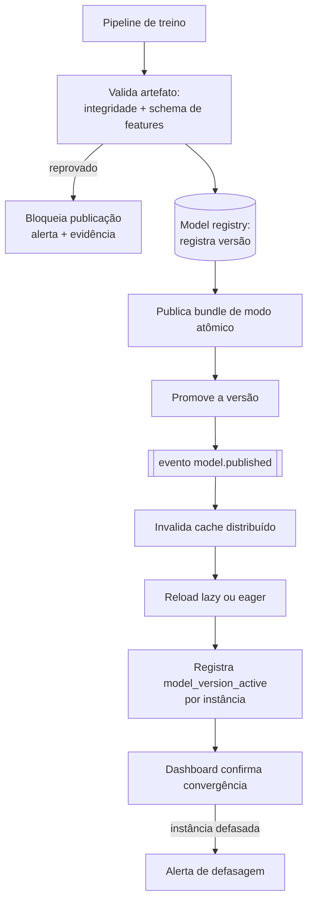

# Evolução prioritária 2 — Publicação de modelos e invalidação de cache

Endereça `LR-03`. Sem isso, nenhuma melhoria de modelo chega à produção de forma confiável e nenhum
incidente de modelo tem rollback rápido.

## AS-IS

- Bundles do HBOS (modelo, scaler, perfis estatísticos, metadados) são servidos via cache em
  memória, por instância.
- Após um retreinamento, o serviço pode continuar usando versões antigas em cache, exigindo restart
  ou limpeza manual.

## Lacuna / Risco

Três consequências, todas silenciosas:

1. **Deriva entre instâncias.** Instâncias diferentes decidem com versões diferentes, e a decisão
   passa a depender de qual pod atendeu a requisição. Não é reproduzível nem defensável em
   contestação.
2. **Correção não chega.** Um modelo com problema conhecido continua decidindo até que alguém
   reinicie o serviço manualmente — na prática, o rollback depende de operação humana sob pressão.
3. **Inferência sem versão registrada é irreprodutível.** Sem `model_version` na inferência, não é
   possível reconstruir por que uma transação foi negada, nem atribuir métricas de performance à
   versão correta.

## TO-BE

### Publicação atômica

Escrita não atômica de bundle produz o pior caso possível: modelo carregado pela metade servindo
decisão. O bundle é publicado em caminho versionado imutável e a ativação é a troca de um ponteiro
(`champion -> versão`). Consequências desejadas:

- leitor nunca observa estado intermediário;
- rollback é reapontar o ponteiro para a versão anterior, que continua existindo;
- duas versões coexistem durante a convergência, o que é requisito para canário.

### Validação antes de publicar

A publicação falha, em vez de degradar, quando:

- o artefato não passa na verificação de integridade (checksum, desserialização, predição de
  smoke test com resultado esperado);
- o schema de features do artefato é incompatível com o que o serviço calcula (nome, tipo, ordem,
  faixa esperada);
- os metadados obrigatórios estão ausentes (versão, janela de treino, métricas de validação
  temporal, estado no registry).

Incompatibilidade de schema é a falha mais perigosa: o modelo carrega, responde e devolve score sem
sentido, porque a feature na posição errada continua sendo um número válido.

### Convergência e defasagem

Cada instância publica `model_version_active` por modelo. O dashboard compara o conjunto de versões
ativas com a versão promovida e mede o **tempo de convergência**. Instância que não converge dentro
da janela é alertada e drenada, não deixada em silêncio.

Contrato do evento: [`model.published`](../contratos/schemas/model.published.schema.json).

## Critérios de aceite

| # | Critério | Como comprovar |
| --- | --- | --- |
| CA-2.1 | 100% das publicações aplicadas sem restart manual | Registro de publicações do período com zero restarts associados; teste em ambiente controlado publicando 3 versões seguidas |
| CA-2.2 | Toda inferência registra a versão de modelo usada | Consulta no trace: 0% de inferências com `model_version` nulo, para HBOS e XGBoost |
| CA-2.3 | Instâncias defasadas são identificadas e alertadas | Teste de caos: bloquear a invalidação em uma instância dispara alerta dentro da janela definida |
| CA-2.4 | Rollback rápido para a versão anterior | Exercício cronometrado de rollback com meta declarada em minutos, comprovado por `model_version_active` convergindo para a versão anterior |
| CA-2.5 | Publicação valida integridade e compatibilidade de schema | Testes negativos: artefato corrompido e artefato com schema divergente são rejeitados com evidência registrada |
| CA-2.6 | Convergência observável | Painel com tempo de convergência p95 por publicação e contagem de versões ativas simultâneas |
| CA-2.7 | Reload não degrada latência | p95 do hot path durante a janela de reload permanece < 100 ms; reload lazy não gera pico de cache miss acima do limite definido |

## Métricas

- Tempo de convergência por publicação (p50, p95, máximo).
- Número de versões ativas simultâneas ao longo do tempo.
- Taxa de cache miss por bundle após invalidação.
- Publicações rejeitadas por motivo (integridade, schema, metadados).
- Tempo médio de rollback.
- Cobertura de `model_version` na inferência (meta: 100%).

## Rollout

1. Instrumentar `model_version` na inferência e no trace. Sem isso, os demais passos não são
   mensuráveis.
2. Registry e publicação atômica em caminho versionado, com o serviço ainda lendo como hoje.
3. Evento `model.published` consumido em modo observação: registra o que invalidaria, sem invalidar.
4. Ativar invalidação e reload em uma instância, comparando decisão contra as demais.
5. Ativar em todas as instâncias, com alerta de defasagem armado.
6. Exercitar rollback deliberadamente em produção controlada, para provar CA-2.4 antes de precisar.

## Riscos da própria evolução

- **Tempestade de reload** ao invalidar tudo simultaneamente: mitigado por reload lazy com
  aquecimento progressivo, ou eager escalonado por instância.
- **Volume de bundles por CPF.** Um modelo por CPF significa cardinalidade alta: invalidação global
  a cada retreino é inviável. A invalidação deve ser granular por chave de bundle, com invalidação
  em lote apenas quando o schema de features muda.
- **Ponteiro de versão como ponto único de falha**: instância deve manter a versão local ativa
  quando o cache distribuído está indisponível (`RC_CACHE_DEGRADED`), sinalizando degradação em vez
  de recusar transações.
