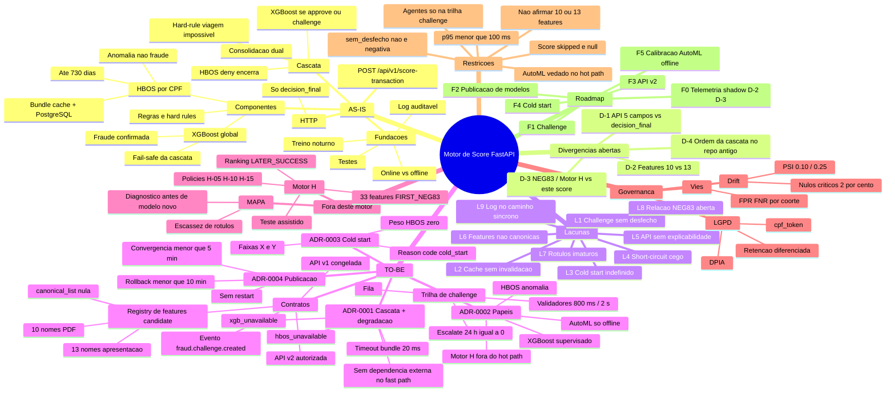
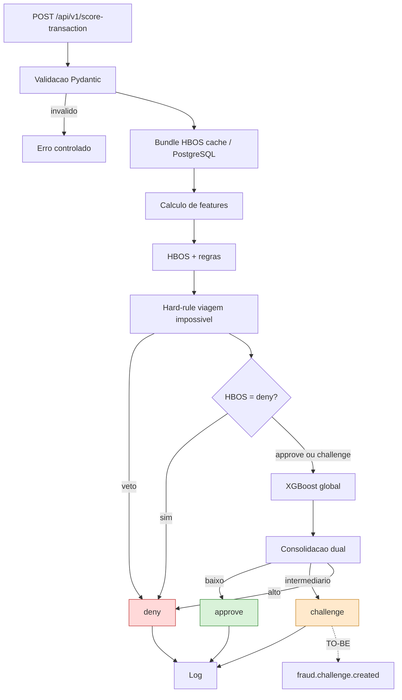
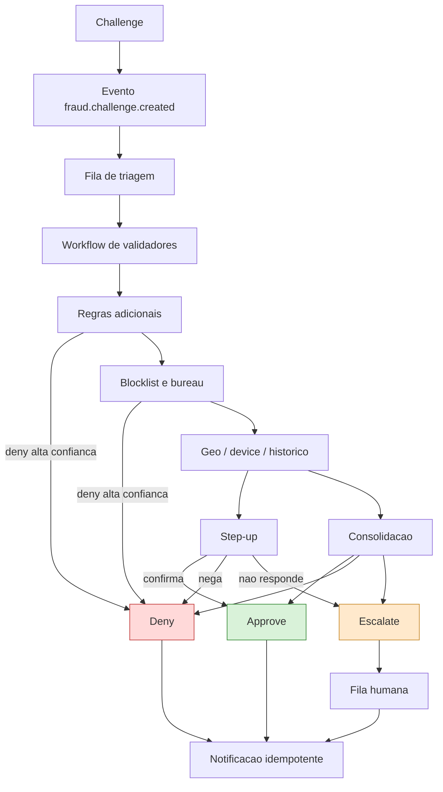
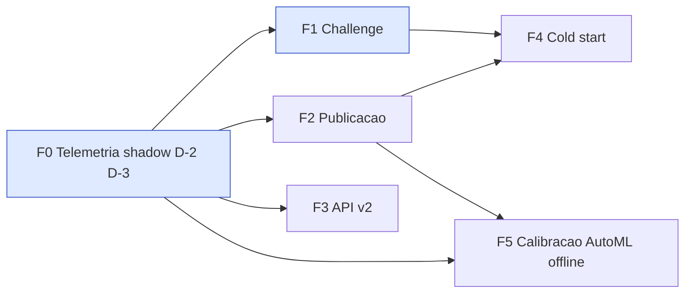

# Mapa mental do projeto

Visão única: o que existe no microserviço FastAPI, o que está aberto, o que foi decidido e
em que ordem executar. Briefing fonte: [contexto-operacional.md](contexto-operacional.md).

## 1. Mapa geral

## 2. Fluxo AS-IS do microserviço

O ponto que diferencia este desenho de propostas anteriores: **o deny do HBOS é terminal no
AS-IS**. Instrumentar e amostrar em shadow é a mitigação imediata; mudar a topologia exige
números ([ADR-0001](adr/0001-topologia-de-decisao.md)).

## 3. Trilha de challenge (TO-BE)

Não-resposta ao step-up → `escalate`, não `deny`.

## 4. Dependência entre fases

## 5. Índice cruzado

| Item | Documento | Fase |
|---|---|---|
| AS-IS do FastAPI | [contexto AS-IS](arquitetura/00-contexto-as-is.md) | — |
| D-1 a D-4 | [divergências](arquitetura/divergencias-documentais.md) | F0 |
| p95 100 ms | [orçamento](arquitetura/orcamento-de-latencia.md) | todas |
| Cascata + degradação | [ADR-0001](adr/0001-topologia-de-decisao.md) | F0 |
| Papéis HBOS/XGB/AutoML | [ADR-0002](adr/0002-papeis-dos-modelos.md) | F5 |
| Cold start | [ADR-0003](adr/0003-politica-de-cold-start.md) | F4 |
| Cache / registry | [ADR-0004](adr/0004-publicacao-de-modelos-e-cache.md) | F2 |
| Challenge | [trilha](workflows/trilha-de-challenge.md) | F1 |
| Features 10 × 13 | [features](contratos/features.md) | F0 |
| MAPA | [acompanhamento](mlops/acompanhamento-modelagem.md) | paralelo |
| Motor H / NEG83 | [Motor H](recuperacao/motor-h-neg83.md) | fora do hot path |
| LGPD | [governança](governanca/lgpd-e-dados-sensiveis.md) | transversal |
