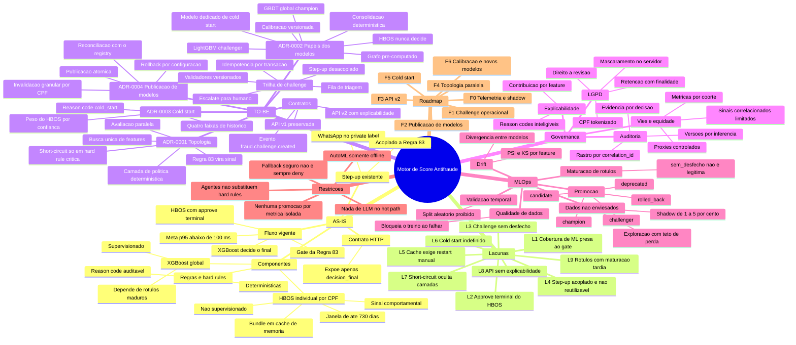
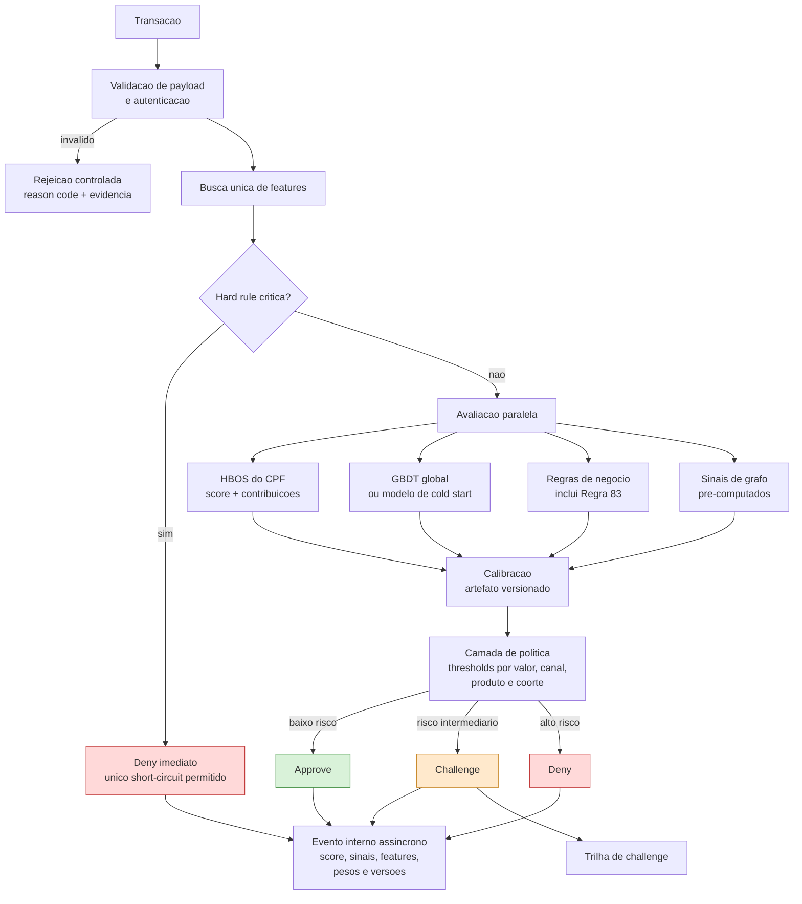
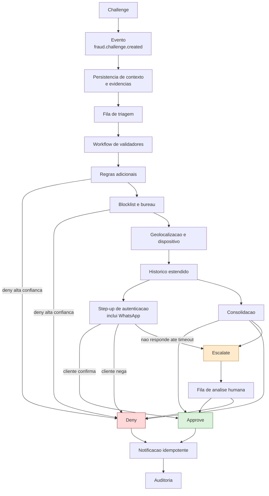
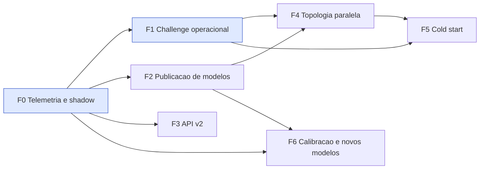

# Mapa mental do projeto

Visão única do motor de score antifraude: o que existe, o que está quebrado, o que foi decidido e
em que ordem executar. Cada ramo aponta para o documento normativo correspondente.

## 1. Mapa geral

## 2. Como ler o mapa

O mapa tem uma direção de leitura: **AS-IS** descreve o que existe, **Lacunas** enumera o que
está quebrado, **TO-BE** traz a decisão registrada para cada lacuna, e **Roadmap** ordena a
execução. **Governança**, **MLOps** e **Restrições** são transversais — atravessam todas as fases
e não são etapas a cumprir e encerrar.

O ramo mais denso é o TO-BE porque é onde estão as decisões. O ramo mais importante é o de
**Restrições**: são os limites que não se negociam por conveniência de prazo.

## 3. Fluxo de decisão TO-BE

O ponto que diferencia este desenho do AS-IS: nenhuma camada emite decisão terminal, exceto hard
rule crítica. Todas as camadas contribuem sinal, e a decisão nasce num só lugar.

## 4. Trilha de challenge

Detalhe que corrige o comportamento atual: **não responder ao step-up leva a `escalate`, não a
`deny`**. Silêncio do cliente é ausência de informação, não fraude confirmada — e essa distinção
precisa sobreviver até a base de rótulos.

## 5. Dependência entre as fases

As duas fases destacadas são as que destravam todo o resto. A aresta `F1 → F4` é a mais fácil de
ignorar e a mais custosa de errar: a topologia paralela **aumenta o volume de challenge**, porque
passa a dar escore a tráfego antes aprovado direto. Sem fila de triagem operando, isso gera
volume sem desfecho — pior que o AS-IS.

## 6. Índice cruzado: lacuna, decisão e fase

| Lacuna | Decisão registrada | Fase |
|---|---|---|
| L1 Cobertura de ML presa ao gate | [ADR-0001](adr/0001-topologia-de-decisao.md) | F4 |
| L2 Approve terminal do HBOS | [ADR-0002](adr/0002-papeis-dos-modelos.md) | F4 |
| L3 Challenge sem desfecho | [Trilha de challenge](workflows/trilha-de-challenge.md) | F1 |
| L4 Step-up acoplado e não reutilizável | [Trilha de challenge](workflows/trilha-de-challenge.md) | F1 |
| L5 Cache exige restart manual | [ADR-0004](adr/0004-publicacao-de-modelos-e-cache.md) | F2 |
| L6 Cold start indefinido | [ADR-0003](adr/0003-politica-de-cold-start.md) | F5 |
| L7 Short-circuit oculta camadas | [Telemetria](observabilidade/telemetria-de-decisao.md) | F0 |
| L8 API sem explicabilidade | [API versionada](contratos/api-versionada.md) | F3 |
| L9 Rótulos com maturação tardia | [MLOps](mlops/dados-rotulos-e-promocao.md) | F6 |

Detalhamento das lacunas em [contexto AS-IS](arquitetura/00-contexto-as-is.md); ordenação completa
e riscos transversais em [roadmap](roadmap.md).
